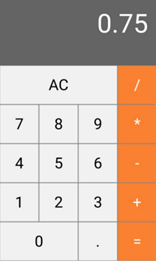
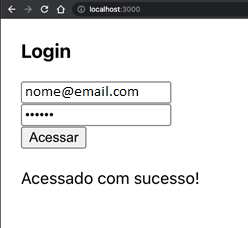

<b>ATIVIDADE FORMATIVA - SEMANA 01</b>

A moda de um array de números inteiros é o número que é repetido mais vezes. Se há mais de um número com mais repetições do que os outros então não há moda. Escreva um algoritmo em Javascript que receba um vetor de inteiros e retorne a moda do vetor. Caso a moda não exista, então informe o usuário.

<b>ATIVIDADE FORMATIVA - SEMANA 02</b>

Nesta semana, foi apresentado o conteúdo de componentes e props em React. Com estes dois conteúdos já é possível criarmos uma aplicação em React do zero.

 Apenas utilizando conhecimento que teve com componentes, props e CSS, crie uma nova aplicação em React com a interface de uma calculadora. A interface deverá ser exatamente igual da imagem abaixo. Não haverá a necessidade de ser funcional, ou seja, caso clique em algum botão, não precisará executar nenhuma ação, deve apenas criar a interface gráfica a partir dos componentes e com o uso de props e CSS.

<b>ATIVIDADE FORMATIVA - SEMANA 03</b>

Com a utilização de Class Componente e state, crie um novo componente que possua 2 (dois) botões e uma label com um número que começa em 0 (zero):

    Botão 1: adicionar 1 ao valor da label.
    Botão 2: subtrair 1 ao valor da label.
    Label: demonstrar o valor no componente.

<b>ATIVIDADE SOMMATIVA - SEMANA 04</b>

Nesta semana, foi apresentado o conteúdo de array em React, fechando assim o conteúdo da criação de um único componente. Com este conhecimento, você deverá realizar uma atividade somativa com todos os conteúdos vistos até o momento.

Com base no conhecimento obtido durante as 4 primeiras semanas, crie uma nova aplicação em React exatamente igual da figura abaixo. No componente, você deverá colocar um título de Login, 2 inputs (e-mail e senha), um botão de validação (Acessar) e uma label. Ao clicar no botão “Acessar”, deverá verificar se o campo de e-mail é igual a “meunome@email.com.br” e senha igual a “123456” (você poderá colocar seu e-mail e senha desejado, o importante é a lógica da construção da aplicação). Caso os valores sejam iguais aos valores do enunciado, deverá ser mostrado a mensagem “Acessado com sucesso!” na label abaixo do botão. Caso algum dos dois campos estejam com valores diferentes do enunciado, deverá ser mostrado a mensagem “Usuário ou senha incorretos!”.

<b>ATIVIDADE FORMATIVA - SEMANA 05</b>

Utilizando o pacote do React Router Dom aprendido durante a semana, crie uma nova aplicação em React com 4 páginas distintas:

<ul>
    <li><b>Home</b>: deverá possuir um título para a página e dois botões, onde deverão redirecionar para as páginas de Contato e Sobre, respectivamente.</li>
    <li><b>Contato</b>: deverá possuir um título para a página e um botão para retornar à página Home. Deverá possuir também, dados referentes ao contato do desenvolvedor, como: nome e e-mail.</li>
    <li><b>Sobre</b>: deverá possuir um título para a página e um botão para retornar à página Home. Deverá possuir também, dados referentes ao desenvolvimento da aplicação, como: linguagem, bibliotecas utilizadas, frameworks, versões. etc.</li>
    <li><b>NotFound</b>: deverá abrir esta página somente quando for executado uma URL não existente na aplicação.</li>
</ul>

<b>ATIVIDADE FORMATIVA - SEMANA 06</b>

Construa uma nova aplicação em React que tenha inicialmente 2 inputs text e 2 botões na página.

<ul>
    <li><b>Input text 1</b>: deverá ser um campo para cadastro do nome do usuário.</li>
    <li><b>Input text 2</b>: deverá ser um campo para cadastro do sobrenome do usuário.</li>
    <li><b>Botão 1</b>: Deverá gravar os valores dos 2 inputs no banco de dados Firestore.</li>
    <li><b>Botão 2</b>: Deverá trazer todos os dados gravados no Firestore e mostrá-los na página do componente.</li>
</ul>

<b>ATIVIDADE SOMATIVA - SEMANAS 07 e 08</b>

Construa uma nova aplicação em React que tenha 3 páginas distintas. Deverá utilizar o React Router Dom para as rotas e navegação. O arquivo de rotas deve estar em um arquivo separado, conforme foi apresentado em aula.

<ul>
    <li><b>Página 1 (Cadastro)</b>: Deverá possuir 5 inputs: e-mail, senha, nome, sobrenome e data de nascimento. Deverá possuir também, um botão ao final para cadastro deste usuário. Deverá criar um usuário no Firebase Authentication utilizando o provedor E-mail/senha e o restante dos dados, gravar no Firestore, trazendo inclusive, o UID do usuário para os atributos no Firestore.</li>
    <li><b>Página 2 (Login)</b>:  Deverá possuir 2 inputs: e-mail e senha. Deverá ter abaixo dos inputs, um botão para acessar a página Principal. Deverá fazer a validação dos valores dos campos do Login no FIrebase Authentication. Se os dados estiverem corretos, mudar para a página Principal, caso contrário, informar o usuário com uma mensagem na tela que o usuário não está cadastrado.</li>
    <li><b>Página 3 (Principal)</b>: Deverá trazer os dados do usuário como: nome, sobrenome e data de nascimento e informá-las na tela.</li>
</ul>

Deverá fazer o build e deploy do projeto e hospedar em um ambiente nuvem em que qualquer pessoa possa acessá-lo.

